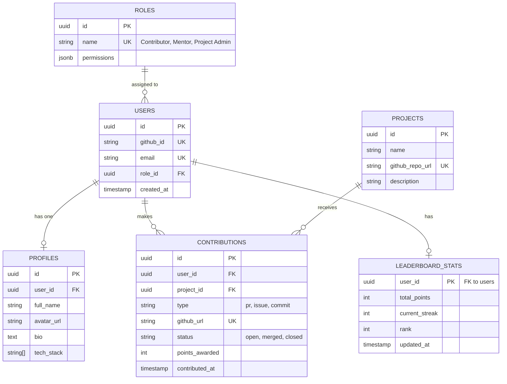

# OSC-India Database Schema (Supabase / PostgreSQL)

This schema is designed to support the requirements outlined in `NEXT_PLANS.md`, including GitHub OAuth integration, role-based access control, user profiles, contribution tracking, and a dynamic leaderboard.

## ER Diagram

## Tables Details

### 1. `roles`
Stores the different roles available in the platform.
- `id` (UUID, Primary Key)
- `name` (String, Unique) - e.g., 'Contributor', 'Mentor', 'Project Admin'
- `permissions` (JSONB) - Optional fine-grained permissions if needed later.

### 2. `users`
The core authentication and identity table. If using Supabase Auth with NextAuth, this can link to the `auth.users` table provided by Supabase.
- `id` (UUID, Primary Key)
- `github_id` (String, Unique) - From GitHub OAuth provider
- `email` (String, Unique)
- `role_id` (UUID, Foreign Key to `roles.id`)
- `created_at` (Timestamp)

### 3. `profiles`
Extended user data separated from the core auth credentials.
- `id` (UUID, Primary Key)
- `user_id` (UUID, Foreign Key to `users.id`, Unique)
- `full_name` (String)
- `avatar_url` (String)
- `bio` (Text)
- `tech_stack` (Array of Strings) - e.g., `['React', 'Next.js', 'Tailwind']`

### 4. `projects`
Stores the open-source projects managed by OSC-India.
- `id` (UUID, Primary Key)
- `name` (String)
- `github_repo_url` (String, Unique)
- `description` (Text)

### 5. `contributions`
Tracks the individual actions a user takes. This table is populated via the GitHub API polling/webhooks.
- `id` (UUID, Primary Key)
- `user_id` (UUID, Foreign Key to `users.id`)
- `project_id` (UUID, Foreign Key to `projects.id`)
- `type` (String) - e.g., 'pr', 'issue', 'commit'
- `github_url` (String, Unique) - URL of the PR or issue to prevent duplicates.
- `status` (String) - e.g., 'open', 'merged', 'closed'
- `points_awarded` (Integer) - Points given for this specific contribution.
- `contributed_at` (Timestamp) - When the contribution happened on GitHub.

### 6. `leaderboard_stats`
An aggregated table for fast querying of the leaderboard. This can be updated via a Supabase Database Trigger whenever a `contributions` row is inserted or updated.
- `user_id` (UUID, Primary Key, Foreign Key to `users.id`)
- `total_points` (Integer) - Sum of all points.
- `current_streak` (Integer) - Calculated based on activity dates.
- `rank` (Integer) - Optional, can be calculated on the fly or cached here.
- `updated_at` (Timestamp)

## Key Optimizations & Workflows
- **Row Level Security (RLS)**: Enable RLS in Supabase so users can only edit their own `profiles`, but `contributions` and `leaderboard_stats` are read-only for public and only updatable by the backend service.
- **Triggers**: Use a PostgreSQL trigger on the `contributions` table to automatically recalculate and update `leaderboard_stats.total_points` when a PR is merged.
- **NextAuth Integration**: When a user logs in for the first time via NextAuth's GitHub provider, use a callback to automatically create a row in the `users` and `profiles` tables.
