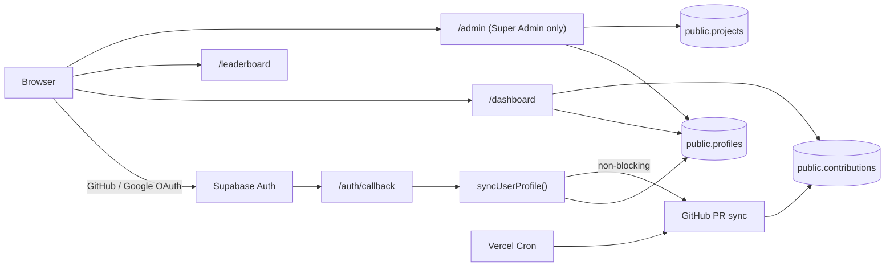
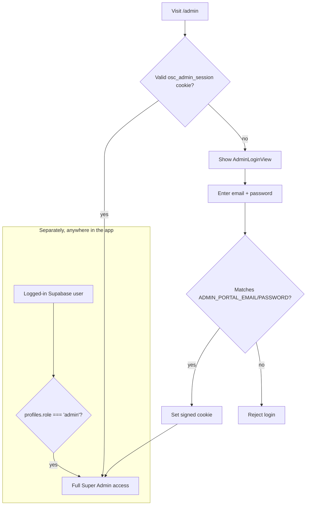

# OSC-India — Project Guide (Plain-English)

This document explains how the whole app works and, in detail, how **roles**
(Contributor / Mentor / Project Admin / Admin) currently behave in the code —
written specifically to support the upcoming work of splitting the **Admin**
and **Project Admin** experiences into two separate pages.

Everything below is based on reading the actual code, not on the plans in
`plan.md` or `DATABASE_SCHEMA.md` (those describe the original intended design;
some of it changed during development — this doc describes what is *actually
running today*).

---

## 1. What this project is

OSC-India (Open Source Club of India) is a **contributor tracking and
leaderboard platform** for an open-source program. In plain terms:

1. Contributors sign in (GitHub or Google).
2. They submit pull requests to a curated list of participating GitHub repos.
3. The app automatically scans GitHub for their merged PRs and awards points.
4. Points show up on a public leaderboard, a personal dashboard, and a
   shareable "contributor badge" image.
5. Project maintainers ("Project Admins") and organizers ("Admins") have
   extra powers to manage people, scores, and the list of tracked projects.

## 2. Tech stack

| Layer | Technology |
|---|---|
| Framework | [Next.js 16 App Router](app) (React 19, TypeScript) — see the note at the top of `CLAUDE.md`, this Next.js version has non-standard docs bundled in `node_modules/next/dist/docs/` |
| Styling | Tailwind CSS v4 |
| Database + Auth | Supabase (hosted Postgres + Supabase Auth) |
| Hosting | Vercel (see [vercel.json](vercel.json)) |
| Badge image export | `html2canvas` (renders the badge card to a PNG client-side) |
| Background jobs | Vercel Cron hitting [app/api/cron/](app/api/cron) routes |

There is **no separate backend server** — "backend" logic lives in:
- **Next.js Server Actions** (`"use server"` files under [lib/actions/](lib/actions)) — called directly from React components, no manually-written API needed.
- **API routes** ([app/api/](app/api)) — used for things that need a plain HTTP endpoint (OAuth callbacks, cron jobs, webhooks-style syncing).

## 3. High-level architecture



## 4. The database (Supabase Postgres)

Real schema lives in [supabase/migrations/0001_unified_schema.sql](supabase/migrations/0001_unified_schema.sql)
(the file [DATABASE_SCHEMA.md](DATABASE_SCHEMA.md) at the repo root is the *original plan* — the
real table names/shapes drifted from it, so trust the migration files over that doc).

The important table is **`public.profiles`**, one row per user:

```
profiles
├── id            (matches Supabase auth.users.id)
├── full_name, email, github, avatar_url
├── role          'contributor' | 'mentor' | 'project-admin' | 'admin'   ⭐ THE ROLE FIELD
├── is_admin      boolean (legacy/secondary flag, mostly superseded by role)
├── score, merged_prs, projects_count, badges_created
```

Every user starts as `role = 'contributor'` (set automatically by a Postgres
trigger, `handle_new_user`, the moment they sign up — see the migration file).
Only a Super Admin can change someone's `role` afterwards (via the Admin
Portal, described below).

Other tables: `projects` (the curated list of tracked OSS repos) and
`contributions` (each tracked PR/issue and the points it earned).

## 5. Signing in

Two login paths, both handled by Supabase Auth:

- **GitHub OAuth** — primary path, since GitHub username is what the points-sync engine matches against.
- **Google Sign-In** — via Google Identity Services popup, see [lib/auth/client.ts](lib/auth/client.ts) `signInWithGoogleIdToken`.

Either way, [app/auth/callback](app/auth/callback) runs, which calls
**`syncUserProfile()`** in [lib/auth/syncProfile.ts](lib/auth/syncProfile.ts). This function:

1. Upserts a row into `public.users` and `public.profiles`.
2. If the person already has a profile (e.g. they logged in with Google after
   previously using GitHub), it **merges by email** so they don't get a
   duplicate account and don't lose their existing GitHub handle/role.
3. Kicks off a non-blocking background GitHub sync (`/api/sync/background`) to
   pull in their merged PRs, capped to once per 30 minutes per user.

Note: a brand-new profile is *always* created with `role: 'contributor'` —
nobody can grant themselves a higher role through sign-in.

## 6. The four roles, explained simply

Stored in `profiles.role`. Here is what each one **actually does today**,
based on the code (not just the name):

### 🟢 Contributor (default)
- Everyone starts here.
- Sees **their own** dashboard: their merged PRs, score, streak calendar, tech stack.
- Appears on the public leaderboard.
- Can generate their own contributor badge image.
- Gets points automatically when their GitHub PRs merge into a tracked repo (logic in [lib/actions/github.ts](lib/actions/github.ts)).

### 🟡 Mentor
- A label a Super Admin can assign to someone from the Admin Portal.
- **Does not unlock any extra pages or buttons.** In the code it only affects two things:
  1. Mentors are **excluded from the GitHub PR points-sync** — see [lib/actions/github.ts:86](lib/actions/github.ts#L86) (`if (userRole === "admin" || userRole === "mentor" ...)`), so their score stays untouched by the automated sync.
  2. Their badge renders with an amber "MENTOR" pill instead of the orange "CONTRIBUTOR" one ([app/badge/BadgeClient.tsx:304](app/badge/BadgeClient.tsx#L304)).
- In short: today, "Mentor" is mostly cosmetic/exempt-from-scoring, not a management role.

### 🟠 Project Admin
This is the role your question is really about. A Project Admin is meant to
be **a maintainer of one specific participating repo**. What happens today:

- **No dedicated page.** They log into the exact same `/dashboard` route as a
  Contributor. The server component ([app/dashboard/page.tsx](app/dashboard/page.tsx))
  detects `role === 'project-admin'` and, instead of showing their personal
  PRs, it:
  - Finds GitHub repos whose URL contains their GitHub username (`app/dashboard/page.tsx:217-258`, the `isProjectAdmin` branch).
  - Shows *those repos'* PR activity and totals instead of "my PRs".
  - The dashboard UI ([app/dashboard/DashboardClient.tsx:161-163](app/dashboard/DashboardClient.tsx#L161)) just swaps a label to "Project Admin" — it's the same component, same layout, just different data and one flag.
- **Scoring**: when the sync engine processes a project-admin, it has a
  special branch ([lib/actions/github.ts:104-114](lib/actions/github.ts#L104)) that awards them points for *all* merged, correctly-labelled PRs across their repo(s) — a maintainer reward for reviewing/merging others' work, not just their own PRs.
- **Backend permissions they already have, but no UI for:** several server
  actions explicitly allow `project-admin`, not just `admin`:
  - `updateUserScore`, `updateUserGithub`, `syncSingleUser`, `triggerRepoDiscoveryAction` — all gated by `requireAdminOrProjectAdmin()` in [lib/actions/admin.ts:55-84](lib/actions/admin.ts#L55).
  - `createProjectAction`, `deleteProjectAction`, `deleteAllProjectsAction` — gated by `checkAdminAuth()` in [lib/actions/projects.ts:237-257](lib/actions/projects.ts#L237), which also accepts `project-admin`.
  - **But** the only UI that calls these functions is `AdminUI.tsx`, and that page is locked to Super Admins only (next section). So today a Project Admin is *authorized* to, say, adjust a contributor's score or sync a user's PRs — they just have **no button anywhere** to do it. This is the gap you'll be closing.

### 🔴 Admin (Super Admin)
- Full control: the `/admin` portal.
- Can change anyone's role, edit/delete users, adjust anyone's score, manage
  the entire tracked-projects list, bulk-resync all contributors, and
  trigger GitHub-topic auto-discovery of new repos.

## 7. How points & scoring actually work (the core engine)

This is the heart of the app, and it's more involved than "PR merged = points."
It lives in [lib/actions/github.ts](lib/actions/github.ts) and
[lib/utils/github-helpers.ts](lib/utils/github-helpers.ts).

### 7.1 The eligibility rule

A PR only counts if **all** of these are true:
1. It was **merged** (not just closed).
2. It targets one of the **tracked repos** — the 17 hardcoded `OFFICIAL_COMPETITION_REPO_SLUGS` in [lib/utils/github-helpers.ts:47](lib/utils/github-helpers.ts#L47), plus anything in the `public.projects` table (including repos auto-discovered via the `osci-2026` GitHub topic — see §10).
3. It carries the **`OSCI'26` label** on GitHub.

If any of those fail, the PR is silently ignored — it never becomes a
`contributions` row and never adds to score.

### 7.2 How difficulty (and therefore points) is decided

`detectDifficulty()` ([lib/utils/github-helpers.ts:105](lib/utils/github-helpers.ts#L105)) looks for keywords in this priority order: **labels first**, then **title/body text** — searching for things like `expert`/`level-4`, `hard`/`advanced`, `medium`/`intermediate`, `easy`/`good-first-issue`. If nothing matches, it defaults to **Easy**.

| Difficulty | Points |
|---|:---:|
| Easy | 10 |
| Medium | 20 |
| Hard | 30 |
| Expert | 50 |

**Difficulty can be inherited from a linked issue.** If a PR's title/body says
something like "Fixes #123", the app fetches issue #123 and re-runs
`detectDifficulty` on it — if the *issue* is harder than the *PR itself*
looks, the higher difficulty wins (`DIFFICULTY_RANK` comparison). This is so
maintainers can label the issue once ("this is a Hard issue") instead of
re-labelling every PR that closes it.

**The bulk/cron engine has one more signal the others don't:** it also looks
at the PR's actual lines changed (`additions + deletions`) and bumps
difficulty based on size (≥800 lines → Expert, ≥250 → Hard, ≥50 → Medium — see
[lib/actions/github.ts:828-836](lib/actions/github.ts#L828)), taking whichever
is higher between the label-based and size-based result. The single-user sync
path (used on login and by the admin's "Sync PRs" button) does **not** do this
size check — see §12 for why that matters.

### 7.3 Contributor vs. Project Admin scoring — two different reward shapes

- **Contributor**: scored only on PRs **they personally authored** — `author:{handle}` in the GitHub search query.
- **Project Admin**: scored on PRs in **repos they own** (matched by their GitHub username being the repo's owner) *or* PRs **they personally clicked merge on**, anywhere in the tracked repos — rewarding maintainer review/merge work, not just their own authored code. See [lib/actions/github.ts:104](lib/actions/github.ts#L104) and the "Project-admin pass" at [lib/actions/github.ts:1021](lib/actions/github.ts#L1021).
- **Mentor / Admin**: excluded entirely — never scored, by design (they're not competing).

### 7.4 The three places a sync can be triggered from

| Trigger | Function | Engine used | Who can fire it |
|---|---|---|---|
| User logs in | `syncUserProfile` → `/api/sync/background` | `syncGitHubContribution` (single-user, GitHub **Search API**) | Automatic, capped to once per 30 min per user |
| Admin clicks "Sync PRs" on one user | `syncSingleUser` (Server Action) | `syncGitHubContribution` | Admin or Project Admin (backend-allowed; see §11) |
| Admin clicks "Sync All Contributors" | `syncAllUsers` (Server Action) | `syncAllProjectsAndContributors` (bulk, GitHub **REST API**, walks every tracked repo's PR list directly) | Super Admin only |
| Scheduled jobs | [app/api/cron/sync-contributors](app/api/cron/sync-contributors) / [sync-leaderboard](app/api/cron/sync-leaderboard) | Bulk engine (contributors) / DB-only aggregation from `contributions` table (leaderboard) | Vercel Cron, protected by `CRON_SECRET` |

`vercel.json` currently schedules `sync-contributors` **once a day at
midnight UTC** and `sync-leaderboard` **once a day at noon UTC** — worth
knowing because the code comment above `sync-contributors/route.ts` describes
it as a "6-Hour Recalculation Cron," which is stale relative to the real
schedule (see §12).

### 7.5 What actually gets written to the database

For every valid PR, a row goes into `public.contributions` (`user_id`,
`project_id`, `points_awarded`, `github_url`, `status: "merged"`), upserted
with `onConflict: "github_url"` — so re-running a sync never double-counts
the same PR. Then `public.profiles.score` / `merged_prs` / `projects_count`
are recalculated from scratch as the *sum* of that user's valid contributions
(not incremented), and `public.leaderboard_stats` is updated to match. This
"always recompute from source of truth" approach is a good design choice — it
means a sync can never drift or double-apply points, even if it's re-run
many times.

## 8. How access to `/admin` is actually gated (important — two separate systems)

This is the part most worth understanding before splitting the pages, because
there are **two independent ways in**, not one:

**A. The normal way — Supabase role check.**
If you're logged in via Supabase (GitHub/Google) and your `profiles.role` is
`'admin'`, you're a Super Admin. See `requireSuperAdmin()` in
[lib/actions/admin.ts:21-50](lib/actions/admin.ts#L21).

**B. The "root" way — a separate email/password login, no Supabase involved.**
[app/admin/AdminLoginView.tsx](app/admin/AdminLoginView.tsx) presents an
email+password form. Credentials are checked against env vars
`ADMIN_PORTAL_EMAIL` / `ADMIN_PORTAL_PASSWORD` in
[lib/auth/admin-auth.ts](lib/auth/admin-auth.ts) (with hardcoded fallback
values if the env vars aren't set — worth setting real env vars in
production for this reason). On success it sets a signed, HTTP-only cookie
(`osc_admin_session`, HMAC-signed, 8-hour expiry) that grants full Super
Admin rights everywhere `requireSuperAdmin()` / `requireAdminOrProjectAdmin()`
are checked — completely independent of whether that browser has a Supabase
session at all.

Path A is "promote a real contributor account to admin." Path B is "the one
hardcoded owner/organizer account," useful as a break-glass login. Both are
checked in every gate function, so either one works.



`requireAdminOrProjectAdmin()` is the same idea but also accepts
`role === 'project-admin'` — this is the function several server actions
already use, confirming the backend is ready for a project-admin-facing UI.

## 9. Tour of every page/route

| Route | Who can see it | Purpose |
|---|---|---|
| [app/page.tsx](app/page.tsx) | Public | Landing page |
| [app/about](app/about) | Public | About the program |
| [app/sign-in](app/sign-in), [app/sign-up](app/sign-up) | Public | OAuth login screens |
| [app/dashboard](app/dashboard) | Logged in | Personal stats for Contributors; repo-management stats for Project Admins (same page, different data — see §6) |
| [app/leaderboard](app/leaderboard) | Logged in | Global ranked list of contributors by score |
| [app/projects](app/projects) | Public/logged in | Directory of participating open-source projects |
| [app/badge](app/badge) | Logged in | Generates a shareable "I'm a contributor/mentor/project admin" image card |
| [app/team](app/team) | Public | Core organizing team |
| [app/timeline](app/timeline) | Public | Program schedule/milestones |
| [app/admin](app/admin) | Super Admin only | The full management portal (see §10) |

API routes ([app/api/](app/api)) worth knowing about:
- `api/auth/sync`, `api/auth/google/*` — OAuth + profile provisioning.
- `api/sync/background`, `api/cron/sync-contributors`, `api/cron/sync-leaderboard` — the automated GitHub PR scanning, run on login and on a schedule.
- `api/badge/*` — badge creation counter + an image proxy (to get around GitHub avatar CORS issues when exporting the badge PNG).
- `api/profile/*` — self-service profile edits (GitHub handle, tech stack).

## 10. What `/admin` currently contains — and what an Admin can actually check

[app/admin/page.tsx](app/admin/page.tsx) does the access check (§8) and, if
authorized, renders **[app/admin/AdminUI.tsx](app/admin/AdminUI.tsx)** — a
single client component with two tabs (`activeTab` state,
[app/admin/AdminUI.tsx:197](app/admin/AdminUI.tsx#L197)):

**Tab 1 — Contributors**
- List/search/filter every user by role.
- Change any user's role (dropdown: contributor/mentor/project-admin/admin).
- Edit a user's GitHub handle.
- Add/set a contributor's score.
- Trigger a GitHub sync for one user, or "sync all" (bulk, all 600+ contributors).
- Delete a user (with protections: can't delete yourself, can't delete the root admin account).

**Tab 2 — Projects**
- Add a new tracked project manually.
- Trigger topic-based auto-discovery (scans GitHub for repos tagged `osci-2026` and ingests them).
- Delete a project (or delete all).

Every one of these calls a Server Action from [lib/actions/admin.ts](lib/actions/admin.ts)
or [lib/actions/projects.ts](lib/actions/projects.ts). As shown in §6, several
of those actions are *already* permission-checked to also allow
`project-admin` — they're just not exposed anywhere a Project Admin can reach
them, because the whole page sits behind `requireSuperAdmin()`.

### What an Admin can actually *see/verify*, per user

Per contributor row in the table ([app/admin/AdminUI.tsx:1251-1345](app/admin/AdminUI.tsx#L1251)):
name, email, GitHub handle (editable), role (editable dropdown), current
**score** (editable — add points or set an absolute value), **merged PR
count** (read-only, only changes via a sync), and **badges created** shown as
`x / 3` (the badge-download feature is capped at 3 per person — see
[app/badge/BadgeClient.tsx](app/badge/BadgeClient.tsx)). Each row also has a
one-click **"Sync PRs"** button to force a fresh recalculation for just that
person.

At the top of the page, `getAdminData()` ([lib/actions/admin.ts:91](lib/actions/admin.ts#L91))
computes aggregate metrics: total users, and counts per role (contributors /
mentors / project admins / admins), plus `totalPRs` and `totalScore` summed
across everyone.

**What an Admin *cannot* currently see from this page:** a per-PR breakdown
of *why* someone has the score they have (which specific PRs, what difficulty
each was scored at). That breakdown only exists on the contributor's own
`/dashboard`. There's also no audit trail of past role changes, past score
edits, or who performed them — every mutation just overwrites the current
value.

## 11. The gap to close (why you need two pages)

Today:
- **Admin** → full portal at `/admin`.
- **Project Admin** → gets a re-skinned `/dashboard`, with real backend
  permission for several management actions but zero UI to use them.

To split them cleanly, the natural approach (matching what the backend
already expects) is:

1. Keep `/admin` exactly as is, still gated by `requireSuperAdmin()` —
   this remains the full-control Super Admin portal.
2. Build a new page (e.g. `/project-admin` or `/manage`) gated by
   `requireAdminOrProjectAdmin()` (already exists — [lib/actions/admin.ts:55](lib/actions/admin.ts#L55)),
   exposing only the subset of actions a maintainer should have over
   *their own project(s)*:
   - View/manage contributors on their repo(s) — reuse `updateUserScore`, `updateUserGithub`, `syncSingleUser`.
   - Manage their own project entry — reuse `createProjectAction`/`triggerRepoDiscoveryAction`.
   - **Not** exposed: changing anyone's role, deleting users, deleting all projects, bulk-syncing every contributor — those should stay Super-Admin-only actions (you'd want to double check each server action actually scopes to "their project" only, since some, like `updateUserScore`, currently just check the caller's role and don't verify the target user belongs to the caller's project).
3. Since a `project-admin` currently gets redirected into `/dashboard`
   with the re-skinned view, you'll want to decide: does `/dashboard` stay
   as their personal contribution view (matching what Contributors and
   Admins see), and the *new* management page becomes where they do
   maintainer tasks? That keeps each page single-purpose instead of the
   current dashboard doing double duty.

## 12. Is the current flow correct? Known inconsistencies worth fixing

Short answer: the overall shape is sound (recompute-from-source-of-truth
scoring, dedup via `onConflict`, anti-self-scoring checks, root-admin
deletion protection are all good patterns), but there are real inconsistencies
in the scoring logic itself that are worth fixing **before** you build the
new Project Admin page on top of it — otherwise the new page will surface
numbers that don't match what the nightly cron computes.

1. **Two scoring engines don't agree on difficulty.** The bulk engine
   (`syncAllProjectsAndContributors`, used by cron + "Sync All") also bumps
   difficulty based on lines-changed; the single-user engine
   (`syncGitHubContribution`, used on login + the per-user "Sync PRs" button)
   does not. Result: the *same person's* score can differ depending on
   whether they were last synced individually or by the nightly bulk job.
   → Recommendation: extract one shared "score this PR" function and use it
   in both places.

2. **Project-admin label matching is stricter in one path than the other.**
   In `syncGitHubContribution`'s project-admin branch
   ([lib/actions/github.ts:141-144](lib/actions/github.ts#L141)), the label
   check is an **exact** match (`pr.labels.some(l => l.name.toLowerCase() === "osci'26")`).
   Everywhere else — the regular contributor branch, and the bulk engine's
   project-admin pass — uses the lenient regex `/osci[- ']?26|osci[- ']?2026/i`
   (`hasOsci26Label`). A PR labeled `OSCI26` (no apostrophe) would count
   everywhere *except* when a project admin is synced individually.
   → Recommendation: use `hasOsci26Label()` consistently in all three places.

3. **`MERGER_POINTS` (flat 5 pts) is defined but never used.** Both scoring
   engines actually give project admins full difficulty points (10/20/30/50)
   per PR they own/merge, not the flat 5-point "merger bonus" the constant
   and its comment describe ([lib/utils/github-helpers.ts:11](lib/utils/github-helpers.ts#L11),
   [lib/actions/github.ts:1021](lib/actions/github.ts#L1021)). Either the
   comment is stale, or a smaller flat "you merged someone else's work" bonus
   was intended and never wired in — worth deciding which behavior is
   actually correct, since it affects how generously project admins are
   scored relative to contributors.

4. **Cron schedule doc comments are stale.** `sync-contributors/route.ts`'s
   header comment says "6-Hour Contributor Recalculation Cron... `0 */6 * * *`",
   but [vercel.json](vercel.json) actually runs it **once a day** (`0 0 * * *`),
   and `sync-leaderboard` once a day at noon (`0 12 * * *`). So contributor
   scores can lag GitHub reality by up to ~24h, not ~6h — fine operationally,
   but the comments should either match reality or the schedule should be
   restored to match the comment.

5. **The most important one for your two-page split:** `updateUserScore` and
   `updateUserGithub` ([lib/actions/admin.ts](lib/actions/admin.ts)) only
   check *"is the caller admin or project-admin"* — they never verify the
   **target** user is actually a contributor on *that specific* project
   admin's repo. Today this is harmless because no UI calls these functions
   as a project-admin. The moment you add a Project Admin page that calls
   them, **any** project admin would be able to edit **any** contributor's
   score or GitHub handle, not just people contributing to their own
   project. → This needs an ownership check added (e.g., "does this
   contributor have a merged PR in one of my repos?") before or as part of
   building the new page — otherwise you'd be shipping a privilege-escalation
   bug, not just a UI feature.

6. **Good patterns already in place, worth keeping as-is:** self-scoring is
   blocked (`updateUserScore`), the root admin account can't be deleted or
   demoted by mistake (`deleteUserAction`), and duplicate PRs can't
   double-count (`onConflict: "github_url"` upserts). Carry these same
   safeguards into whatever the new Project Admin page does.

## 13. Quick capability matrix (current code behavior)

| Capability | Contributor | Mentor | Project Admin | Admin |
|---|:---:|:---:|:---:|:---:|
| See own dashboard/PRs | ✅ | ✅ | ➖ (sees managed repo instead) | ✅ |
| Get scored automatically from GitHub | ✅ | 🚫 (excluded) | ✅ (own repo's merged PRs) | 🚫 |
| Appear on leaderboard | ✅ | ✅ | ✅ | ✅ (excluded from rank calc) |
| Generate badge | ✅ | ✅ (amber pill) | ✅ (red "PROJECT ADMIN" pill) | ✅ |
| Edit a contributor's GitHub handle / score | 🚫 | 🚫 | ✅ (backend allows; no UI yet) | ✅ |
| Sync one user's PRs on demand | 🚫 | 🚫 | ✅ (backend allows; no UI yet) | ✅ |
| Add/discover projects | 🚫 | 🚫 | ✅ (backend allows; no UI yet) | ✅ |
| Change anyone's role | 🚫 | 🚫 | 🚫 | ✅ |
| Delete users / delete all projects | 🚫 | 🚫 | 🚫 | ✅ |
| Access `/admin` portal | 🚫 | 🚫 | 🚫 | ✅ |

---

*Generated from a full read of the auth, role, and admin code paths as of the
current `sam` branch. If the role names or gate functions change, re-check
[lib/actions/admin.ts](lib/actions/admin.ts) and [lib/actions/projects.ts](lib/actions/projects.ts) first — those two files are the source of truth for who can do what.*
