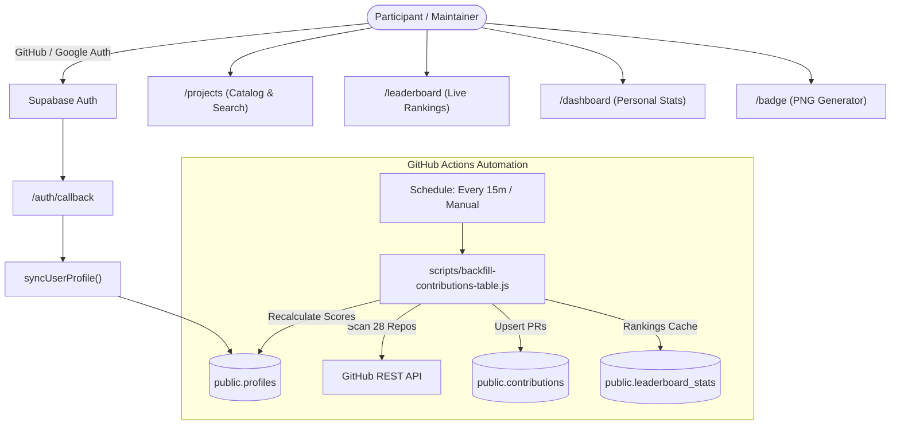

# 🚀 OSC-India (Open Source Club of India)

[](https://nextjs.org/)
[](https://react.dev/)
[](https://www.typescriptlang.org/)
[](https://tailwindcss.com/)
[](https://supabase.com/)
[](https://github.com/features/actions)

Welcome to **OSC-India**, the official platform for **OSCI'26 (Open Source Club of India Competition 2026)**. This platform automates contributor merit tracking, real-time leaderboard rankings, project discovery, and credential verification across the official **28 participating open-source repositories**.

---

## 🌟 Highlights & Features

- **🏆 Real-Time Community Leaderboard (`/leaderboard`)**
  - Instant ranking updates backed by Supabase PostgreSQL and real-time change feeds.
  - Interactive top-3 podium layout with dynamic search by name or `@github` handle.
- **📂 Curated Projects Directory (`/projects`)**
  - Explore the official 28 competition projects.
  - Responsive real-time search with instant filtering by project title, description, tech stack, and tags.
- **📊 Contributor Dashboard (`/dashboard`)**
  - Track individual pull request history, verified merit points, activity streaks, and language breakdown.
- **🎖️ Badge Studio (`/badge`)**
  - Dynamic client-side generated contributor credentials and achievement badges with one-click PNG export (`html2canvas`).
- **🛡️ Role-Based Portals**
  - **Contributor:** Standard competition participant.
  - **Mentor:** Guides and mentors (exempt from scoring).
  - **Project Admin (`/project-admin`):** Repo maintainers with maintainer reward scoring and PR review dashboards.
  - **Super Admin (`/admin`):** Full control over users, projects, manual score recalculation, and system metrics.
- **⚡ Automated GitHub Actions Synchronization**
  - Dedicated background workflow runs every 15 minutes (`.github/workflows/sync-leaderboard.yml`).
  - High-performance, quota-efficient engine (`scripts/backfill-contributions-table.js`) with 5,000 req/hr authenticated rate limits and multi-tier author matching.

---

## 📐 Scoring & Point Distribution

Points are automatically awarded when pull requests meet the following criteria:
1. **Target Repository:** Must be one of the official **28 competition repositories**.
2. **Status:** The pull request must be **merged**.
3. **Label:** The PR must carry the **`OSCI'26`** label on GitHub.

### Difficulty Tiers & Points

| Difficulty Tier | Points Awarded | Recognized Keywords / Labels |
| :--- | :---: | :--- |
| **Easy** | **10 pts** | `easy`, `level-1`, `beginner`, `good-first-issue` *(Default)* |
| **Medium** | **20 pts** | `medium`, `level-2`, `intermediate`, `mid` |
| **Hard** | **30 pts** | `hard`, `level-3`, `advanced` |
| **Expert** | **50 pts** | `expert`, `level-4` |

> **Note:** Points can also be inherited from a linked issue (e.g. `Fixes #123`) if the issue specifies a higher difficulty tier.

---

## 🏗️ Architecture & Tech Stack



| Layer | Technology |
| :--- | :--- |
| **Framework** | [Next.js 16](https://nextjs.org/) (App Router, Server Actions, Dynamic Routes) |
| **Frontend** | [React 19](https://react.dev/), [Tailwind CSS v4](https://tailwindcss.com/) |
| **Database** | [Supabase](https://supabase.com/) (PostgreSQL, Row-Level Security, Realtime Subscriptions) |
| **Authentication** | Supabase Auth (GitHub OAuth & Google Sign-In) |
| **Automation** | GitHub Actions (`.github/workflows/sync-leaderboard.yml`) |
| **Badge Export** | `html2canvas` client-side rendering |
| **Deployment** | [Vercel](https://vercel.com/) |

---

## 📁 Repository Structure

```text
OSC-India/
├── .github/
│   └── workflows/
│       ├── sync-leaderboard.yml   # 15-minute scheduled leaderboard sync
│       └── cron-sync.yml          # Secondary background API cron
├── app/
│   ├── (auth)/                    # Sign-in & Sign-up routes
│   ├── admin/                     # Super Admin Portal
│   ├── api/                       # API routes (OAuth, cron, background sync)
│   ├── badge/                     # Shareable Contributor Badge Studio
│   ├── components/                # Reusable UI components (Navbar, Footer, Modals)
│   ├── dashboard/                 # Contributor & Maintainer Dashboard
│   ├── leaderboard/               # Real-time Public Leaderboard
│   ├── project-admin/             # Project Maintainer Portal
│   └── projects/                  # 28 Projects Catalog with Instant Search
├── data/
│   └── custom-projects.json       # Official 28 competition projects metadata
├── lib/
│   ├── actions/                   # Next.js Server Actions (github, projects, admin)
│   ├── supabase/                  # Supabase browser, server, and admin clients
│   └── utils/                     # GitHub helper utilities and difficulty parsers
├── scripts/
│   ├── backfill-contributions-table.js  # Core 28-repo backfill & sync engine
│   └── auto-sync-scheduler.js           # Local sync scheduler
└── supabase/
    ├── migrations/                # Unified PostgreSQL schema migrations
    └── seed_projects.sql          # Seed script for the official 28 projects
```

---

## 🚀 Getting Started

### Prerequisites

- **Node.js**: `v20.x` or `v22.x`
- **Package Manager**: `npm`, `pnpm`, or `yarn`
- **Supabase Account**: A Supabase project with PostgreSQL and Auth enabled.
- **GitHub PAT (Personal Access Token)**: A classic or fine-grained token with `public_repo` read permissions to avoid rate limits.

### 1. Clone the Repository

```bash
git clone https://github.com/open-source-connect-01/OSC-India.git
cd OSC-India
```

### 2. Install Dependencies

```bash
npm install
```

### 3. Configure Environment Variables

Create a `.env.local` file at the root of the project (you can copy `.env.example`):

```bash
cp .env.example .env.local
```

Fill in the required values:

```env
# Supabase
NEXT_PUBLIC_SUPABASE_URL=https://your-project.supabase.co
NEXT_PUBLIC_SUPABASE_ANON_KEY=your-supabase-anon-key
SUPABASE_SERVICE_ROLE_KEY=your-supabase-service-role-key

# GitHub Authentication & Sync
AUTH_GITHUB_ID=your-github-oauth-app-id
AUTH_GITHUB_SECRET=your-github-oauth-app-secret
GITHUB_ACCESS_TOKEN=your-github-personal-access-token

# Admin & Cron
CRON_SECRET=your-cron-secret
ADMIN_PORTAL_EMAIL=admin@example.com
ADMIN_PORTAL_PASSWORD=your-secure-password
ADMIN_SESSION_SECRET=your-random-secret
```

### 4. Database Setup

Apply the unified database migrations to your Supabase project:

1. Open your Supabase Dashboard $\rightarrow$ **SQL Editor**.
2. Run the SQL statements from [`supabase/migrations/0001_unified_schema.sql`](supabase/migrations/0001_unified_schema.sql).
3. Seed the official 28 projects using [`supabase/seed_projects.sql`](supabase/seed_projects.sql).

### 5. Run the Development Server

```bash
npm run dev
```

Open [http://localhost:3000](http://localhost:3000) in your browser.

---

## 🛠️ Available Scripts

| Command | Description |
| :--- | :--- |
| `npm run dev` | Starts the Next.js local development server. |
| `npm run build` | Builds the production bundle with webpack optimization and TypeScript verification. |
| `npm run start` | Runs the production build locally. |
| `npm run lint` | Runs ESLint to check for code quality and syntax issues. |
| `npm run sync` | Manually runs the strict 28-repository backfill and score recalculation engine. |

---

## 🔄 GitHub Actions Setup (Automated Leaderboard Sync)

To enable the automated 15-minute scheduled leaderboard sync in your GitHub repository:

1. Go to your repository on GitHub.
2. Navigate to **Settings** $\rightarrow$ **Secrets and variables** $\rightarrow$ **Actions**.
3. Add the following **Repository Secrets**:
   - `PAT_TOKEN`: Your GitHub Personal Access Token (5,000 req/hr quota).
   - `NEXT_PUBLIC_SUPABASE_URL`: Your Supabase API URL.
   - `SUPABASE_SERVICE_ROLE_KEY`: Your Supabase service role secret key.
4. The workflow in [`.github/workflows/sync-leaderboard.yml`](.github/workflows/sync-leaderboard.yml) will automatically run every 15 minutes. You can also trigger an instant run from the **Actions** tab by clicking **"Run workflow"**.

---

## 🤝 Contributing

Contributions from the community are welcome!
1. Fork the repository.
2. Create a feature branch: `git checkout -b feature/amazing-feature`.
3. Commit your changes: `git commit -m 'Add amazing feature'`.
4. Push to your branch: `git push origin feature/amazing-feature`.
5. Open a Pull Request targeting `main`.

---

## 📄 License

This project is open-source and available under the [MIT License](LICENSE).
